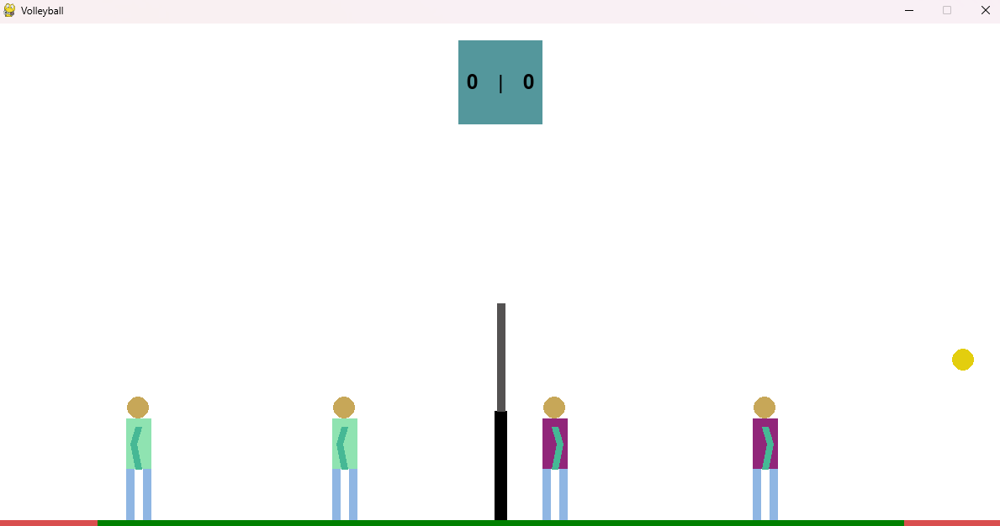

# VolleyballGame




# Описание

Волейбол на Python для двоих игроков, против ПК.
- Один игрок - нападающий, другой - связующий
- Из игровых действий - прием, пас, удар, подача
- Возможность совершать два варианта нападающего удара:
    - "Обычный", связующий стоит, пас высокий
    - "Взлет", связующий дает невысокий пас в прыжке
- Подача пока выполняется только со стороны компьютера
- Обработка большинства игровых ситуаций:
    - Касание сетки
    - Мяч попал в поле или аут
    - Превышение лимита касаний на одну команду
    - Удар в сетку


# Запуск

- Запустить main.exe

Для двух следующих способов нужно установить зависимости из src/requirements.txt:

```
pip install -r src/requirements.txt
```

Далее:
- Перейти в папку src и запустить в компиляторе main.py
- Перейти в папку src и запустить через командную строку main.py

```
cd src
python main.py
```

# Игровой процесс
Ваша сторона - левая.

Для начала игры и последующих подач нужно нажать '**f**' на клавиатуре, будет произведена подача на вашу сторону со стороны противника.

После завершения розыгрыша нажмите '**esc**' для закрытия всплывающего окна и обновления позиций игроков и мяча.

### Управление нападающим (по умолчанию персонаж слева):
- '**a**' и '**d**' - движение влево и вправо соответственно
- '**s**' - прием
- '**w**' - прыжок
- '**space**' - атака

Чем выше выше будет высота съема (высота мяча во время удара по нему), тем острее будет угол траектории по отношению к вертикальной плоскости.

### Управление связующим (по умолчанию справа)
- '**left**' и '**right**' - движение влево и вправо соответственно 
- '**up**' - прыжок
- '**down**' - пас

Чтобы отдать низкий пас на "Взлет" - нужно нажать кнопку паса во время прыжка.

# Краткое описание файлов

## main.py
В main.py прописан основной цикл работы программы, обработка нажатий на клавиши, а так же функции для вывода некоторых элементов на экран.

## volleyballClasses.py
В этом файле написаны классы игроков, ботов и мяча

## mathOperations.py
Здесь функции, отвечающие за вычисление траекторий полета мяча

## constants.py
Все константы
